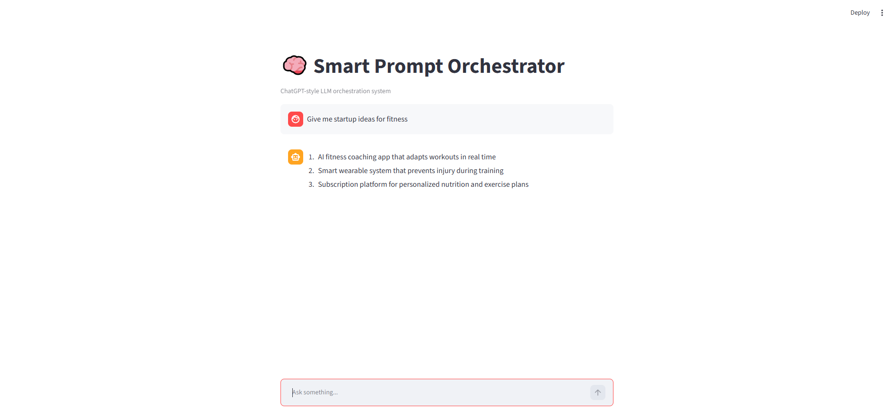
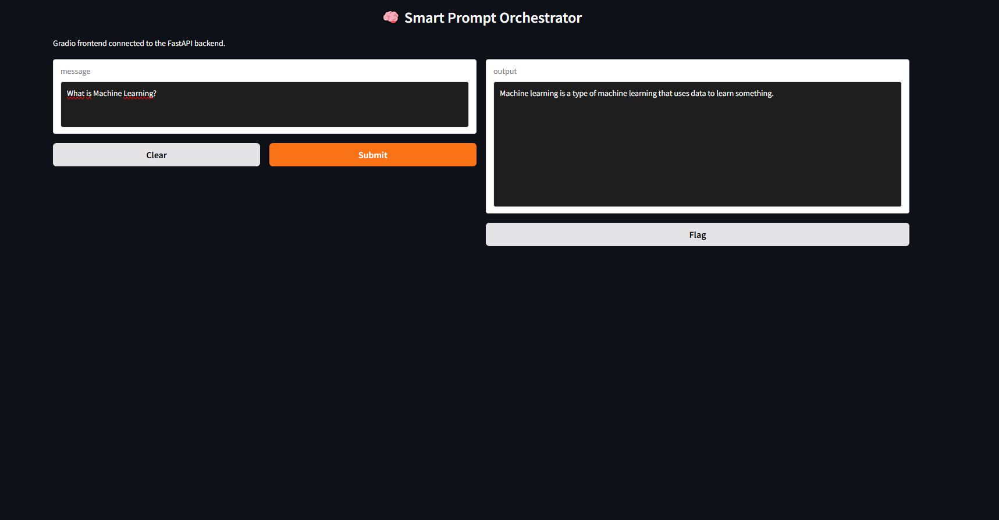

# 🧠 LangChain Smart Prompt Orchestrator
# 🧰 Technologies Used


</p>


## 🚀 Project Overview
A modular and experimental **LLM orchestration system** built using **LangChain, FastAPI, Streamlit, Gradio, and Docker**.

This project demonstrates how to design a **multi-chain AI system** that routes user prompts intelligently to different processing pipelines.


<p align="center">
  
  &nbsp;&nbsp;&nbsp;&nbsp;&nbsp;
  
</p>


# 🚀 Project Goal

The goal of this project is to build a **simple but scalable LLM system architecture** that can:

- Understand user input
- Route it to the correct processing chain
- Generate structured responses
- Expose results through APIs and UI interfaces

---

# 🧠 Problem Statement

Traditional LLM usage is often:

- Unstructured
- Single-purpose
- Hard to scale or modularize

This project solves that by introducing:

👉 A **prompt orchestration layer**

that decides how to process each request dynamically.

---

# 🏗️ Core Idea

Instead of sending all prompts directly to a model, we introduce:

### 🔀 A Routing System

It decides whether the input should go to:

- 📘 Explain Chain
- 🧾 Summarize Chain
- 💡 Idea Generation Chain

---

# ⚙️ System Overview (High-Level)
```
User Input
↓
Router (decision layer)
↓
Selected Chain (logic layer)
↓
Hugging Face Model (generation)
↓
Final Response
```
---

# 🧩 Key Components

### 1. Router Layer
Responsible for deciding which chain to activate based on input.

### 2. Chains Layer
Contains different LLM behaviors:
- Explain logic
- Summarization logic
- Idea generation logic

### 3. Model Layer
Uses Hugging Face transformer model:
- `google/flan-t5-base`

---

# 🎯 What You Will Learn From This Project

- How LangChain chains work
- How to design modular LLM systems
- How routing logic improves LLM applications
- Basic MLOps architecture thinking

---

# 🏗️ Project Architecture

This system is designed using a **modular LLM architecture** that separates responsibilities into independent layers.

---

# 🧠 High-Level Architecture
```
Streamlit / Gradio UI
↓
FastAPI Backend
↓
Router Layer (LangChain logic)
↓
Chains Layer (Explain / Summarize / Ideas)
↓
Hugging Face Model (Flan-T5)
```

---

# 🔄 Data Flow Explanation

### Step 1 — User Input
User sends a prompt from UI (Streamlit or Gradio).

### Step 2 — API Layer
FastAPI receives the request and forwards it to the routing system.

### Step 3 — Router Decision
The router analyzes the input and selects the correct chain:

- Explain → educational response
- Summarize → condensed output
- Ideas → creative generation

### Step 4 — Chain Execution
Each chain applies:
- specific prompt template
- LLM call
- post-processing logic

### Step 5 — Model Inference
The Hugging Face model generates the final response.

---

# 🧱 Project Structure

The project follows a clean modular design:

```
src/
│
├── api/           # FastAPI endpoints
├── chains/        # LLM chains (core logic)
├── prompts/       # Prompt templates
├── routers/       # Routing logic
├── models/        # Model loader
├── config/        # Global settings
```

---

# ⚙️ Tech Stack

## Core Technologies

- 🐍 Python 3.10+
- 🔗 LangChain
- ⚡ FastAPI
- 🎨 Streamlit
- 🎨 Gradio
- 🤗 Hugging Face Transformers

---

## DevOps / MLOps Tools

- 🐳 Docker
- 🐳 Docker Compose
- 📦 pip / requirements.txt
- 🧪 pytest (for testing)

---

# 🧠 Why This Architecture?

This design was chosen to demonstrate:

### ✔ Separation of concerns
Each component has a single responsibility.

### ✔ Scalability
New chains can be added without changing core logic.

### ✔ Maintainability
Model, router, and API layers are independent.

### ✔ Production mindset
Similar structure to real ML systems in industry.

---

# 📌 Design Principle

```
Never send raw user input directly to a model.
Always route + process + structure first.
```
---

# ⚙️ Features

This project demonstrates a complete **LLM orchestration system** with modular components and multiple interfaces.

---

## 🧠 Core Features

- 🔀 Intelligent prompt routing system
- 🧩 Modular LangChain-based architecture
- ⚡ FastAPI backend for inference
- 🎨 Streamlit ChatGPT-style interface
- 🎨 Gradio experimental interface
- 🐳 Dockerized multi-service deployment
- 📦 Reproducible environment setup
- 🧪 Structured prompt testing pipeline

---

# 🧪 Supported Use Cases

The system supports three main types of tasks:

---

## 📘 1. Explain Mode

Used for educational and conceptual explanations.

### Example:
```
What is machine learning?
```

### Expected Behavior:
- Clear explanation
- Simple language
- Structured response

---

## 🧾 2. Summarization Mode

Used for compressing long text into key ideas.

### Example:
```
AI is transforming industries by automating tasks and improving decision-making.
```


### Expected Behavior:
- Shorter output
- No repetition
- Key ideas preserved

---

## 💡 3. Idea Generation Mode

Used for creative brainstorming tasks.

### Example:
```
startup ideas for fitness
```

### Expected Behavior:
- Bullet points
- Multiple ideas
- Creative variation

---

# 🧪 Testing Strategy

To validate system behavior, we test:

---

## ✔ Router Accuracy

We check whether the system correctly selects the chain:

- Explain → conceptual queries
- Summarize → compression tasks
- Ideas → creative prompts

---

## ✔ Chain Consistency

Each chain must:

- Follow its prompt template
- Maintain output format
- Avoid mixing behaviors

---

## ✔ Model Behavior

We observe:

- Repetition issues (expected with small models)
- Output structure consistency
- Response quality variation

---

# ⚠️ Known Limitations

- Uses `google/flan-t5-base` model
- Small model → limited reasoning ability
- May produce repetition in creative tasks
- Not production-grade LLM (intentional for learning)

---

# 🧠 Key Insight

Even with a limited model, the system demonstrates:
```
Good architecture can exist independently of model quality.
```

---

# 📌 Final Takeaway

This project is a **learning-grade LLM orchestration system** that successfully demonstrates:

- Modular design
- Prompt routing logic
- Multi-interface deployment
- Docker-based architecture

# 🐳 Docker Setup (Production-Style Execution)

This project includes a **multi-service Docker architecture** using Docker Compose.

It runs:

- ⚡ FastAPI backend
- 🎨 Streamlit frontend
- (Optional) Gradio local experiment

---

## 🚀 Build the system

Run the following command in the project root:
```
docker compose build
```

---

## ▶️ Start the system
```
docker compose up
```


This will start:

- FastAPI server → http://localhost:8000
- Streamlit UI → http://localhost:8501

---

## 🛑 Stop the system
```
docker compose down
```


---

# 🌐 API Usage (FastAPI)

The system exposes a single orchestration endpoint:

## 📡 Endpoint
```
POST /route
```


---

## 📥 Request format

Send a JSON payload:

```
{
"text": "your prompt here"
}
```

---

## 📤 Response format

```
{
"response": "model output"
}
```

---

## 🧪 Example request
```
POST http://localhost:8000/route
```


Body:
```
{
"text": "What is machine learning?"
}
```

---

# 🎨 Streamlit Interface

Access the UI at:
```
http://localhost:8501
```


Features:

- ChatGPT-style interface
- Message history
- Typing effect simulation
- Clean conversational UX

---

# 🎨 Gradio Interface (Experimental)

Gradio is included for comparison purposes.

Run locally:
```
python gradio_app.py
```


Then open:
```
http://localhost:7860
```

---

# ⚖️ Streamlit vs Gradio Comparison

## Streamlit
- Better UI control
- More production-friendly
- Chat-like experience

## Gradio
- Faster to prototype
- Simpler UI
- Great for ML demos

---

# 📦 Environment Setup

Install dependencies:
```
pip install -r requirements.txt
```

---

# ⚠️ Final Notes

## Model Limitation

This project uses:
```
google/flan-t5-base
```


This means:

- Not a large-scale LLM
- May repeat phrases in creative tasks
- Limited reasoning ability

---

## System Strength

Despite model limitations, the system demonstrates:

- ✔ Clean LLM architecture
- ✔ Modular LangChain design
- ✔ Real routing system
- ✔ API + UI integration
- ✔ Docker multi-service deployment

---

# 🧠 Final Conclusion

This project is a **complete LLM orchestration system prototype** that demonstrates:

- End-to-end ML system design
- Prompt routing architecture
- Multi-interface deployment
- Production-style containerization

---

# 🚀 Future Improvements

- Upgrade to larger LLM (Flan-T5 Large or OpenAI)
- Add caching layer (Redis)
- Add authentication layer
- Deploy to cloud (AWS / Azure)
- Add monitoring (logging + metrics)
- Improve prompt stability

---

# 👨‍💻 Author

AI Engineering Learning Project by Alvaro Vega

AI Engineering Project Built for portfolio and production-style demonstration

Aspiring AI Engineer | Machine Learning Engineer | AI Systems

Built as a hands-on ML engineering project focused on:

- LangChain systems
- MLOps fundamentals
- LLM application architecture
- Docker-based deployment

🔗 GitHub: https://github.com/Javier-DataScience

